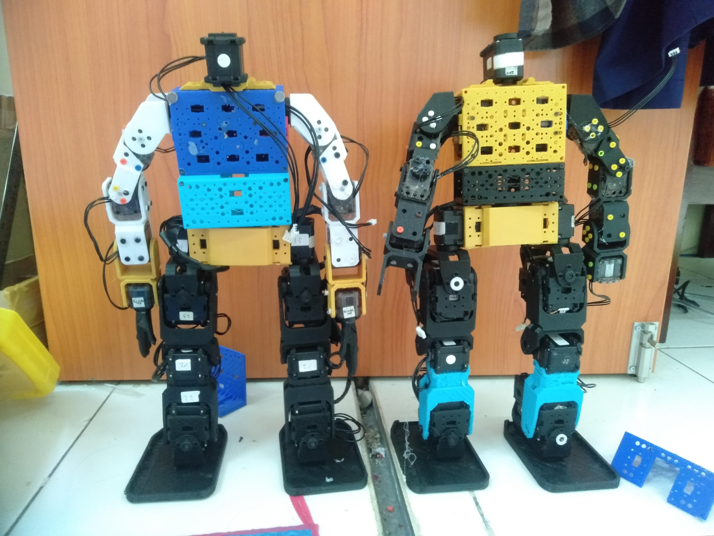

# Humanoid Dancing Robot Using Dynamixel AX-12A

## Project Overview

Developed a humanoid dancing robot using multiple Dynamixel AX-12A smart servos. The project involved configuring servo communication, calibrating joint angles, programming synchronized body movements, and creating dance routines using Arduino and ROBOTIS software tools.

  

Terdapat 3 divisi, yaitu mekanik, elektronik dan programming.
Detail dokumentasi setiap divisi dipisahkan sesuai branch pada repositori ini.
Mekanik
- [Mekanik](https://github.com/IPB-Robotic-Club/tanaya-v1-krsti-2023/tree/mechanic)

Electrical
- [Schematic](https://github.com/IPB-Robotic-Club/tanaya-v1-krsti-2023/tree/electro)
- [Electrical Test Program](https://github.com/IPB-Robotic-Club/krsti2022-program)

Programming
- [Program Code Test](https://github.com/IPB-Robotic-Club/Code-move-robot)
- [Program Code Final](https://github.com/IPB-Robotic-Club/JuaraKRSTI-2023)

## Development Process

### ESP32 Board Package
Installed the ESP32 board package through the Arduino IDE Board Manager to enable programming and uploading code to the ESP32.
Add the Board Manager URL
1. Open the Arduino IDE.
2. Go to File > Preferences (or Arduino IDE > Settings... on macOS).
3. Locate the Additional Boards Manager URLs field at the bottom.
4. Click the icon to the right of the field and paste the following URL into the box: https://espressif.github.io/arduino-esp32/package_esp32_index.json

#### Dynamixel2Arduino Library

Used to communicate with AX-12A servos through the Dynamixel protocol from Arduino. The library supports reading and writing servo parameters such as position, speed, and torque. ([Arduino Libraries][1])

[Dynamixel2Arduino GitHub Repository](https://github.com/jumejume1/Dynamixel-12A-ESPBlynk)

### Install Dynamixel Wizard 2.0

Dynamixel Wizard 2.0 is the official ROBOTIS software used for servo configuration, diagnostics, firmware management, and motion testing. It allows users to detect servos, change IDs, configure baud rates, and monitor servo status in real time. ([ROBOTIS e-Manual][2])

[Dynamixel Wizard 2.0 Download Page](https://emanual.robotis.com/docs/en/software/dynamixel/dynamixel_wizard2/?utm_source=chatgpt.com)

### 4. Servo Detection and Configuration

Using Dynamixel Wizard 2.0:

* Scanned all connected AX-12A servos.
* Assigned unique IDs to each servo.
* Configured communication baud rate.
* Enabled torque control.
* Verified proper communication with every joint. ([ROBOTIS e-Manual][2])

### Motor Testing

Before programming the robot:

* Tested each AX-12A individually.
* Rotated servos manually using Dynamixel Wizard.
* Verified rotation direction.
* Identified mechanical limits of each joint.
* Checked for communication errors and abnormal behavior. ([ROBOTIS e-Manual][2])

### Joint Angle Calibration

For each robot joint:

* Determined the home position.
* Recorded minimum and maximum safe angles.
* Adjusted offsets to ensure symmetrical posture.
* Stored calibration values for software implementation.

### References

* [Dynamixel2Arduino Library](https://github.com/ROBOTIS-GIT/Dynamixel2Arduino?utm_source=chatgpt.com)
* [Dynamixel Wizard 2.0](https://emanual.robotis.com/docs/en/software/dynamixel/dynamixel_wizard2/?utm_source=chatgpt.com)
* [ROBOTIS Documentation Center](https://docs.robotis.com/?utm_source=chatgpt.com)

